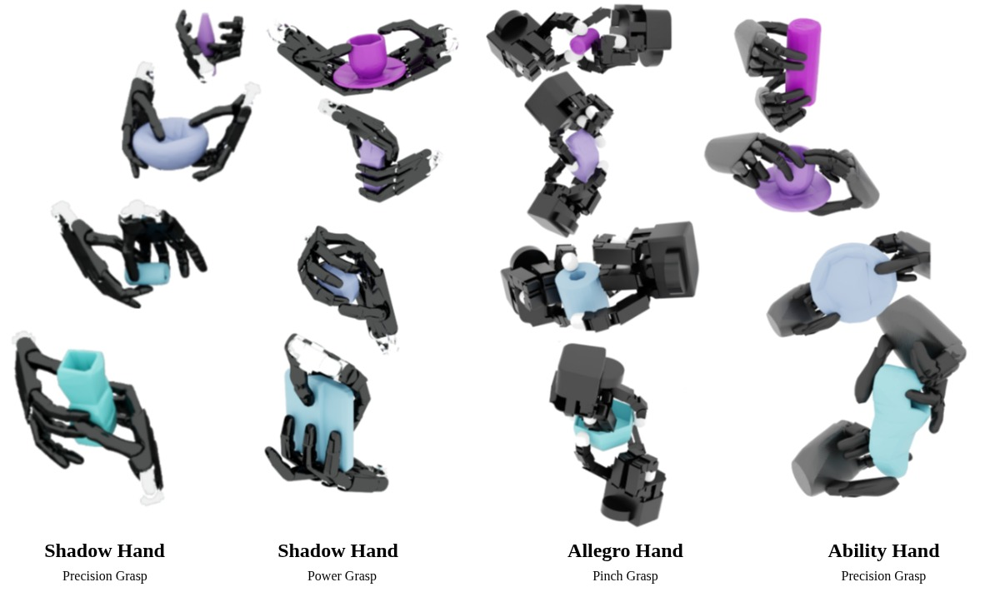

# GraspQP: Differentiable Optimization of Force Closure for Diverse and Robust Dexterous Grasping

<p align="center">
  <a href="https://arxiv.org/abs/2508.15002"></a>
  <a href="LICENSE"></a>
  
  
</p>

<p align="center">
  <a href="https://graspqp.github.io/">Project Page</a> •
  <a href="https://arxiv.org/abs/2508.15002">Paper (arXiv)</a>
</p>

<p align="center">
  
</p>

This is the official implementation of “GraspQP: Differentiable Optimization of Force Closure for Diverse and Robust Dexterous Grasping” (CoRL 2025).

## Abstract

GraspQP synthesizes diverse, robust dexterous grasps by optimizing a differentiable energy that encodes force closure via a quadratic program (QP). Coupling analytic hand kinematics and contact models with signed-distance fields enables gradient-based optimization over hand pose and joint angles. The method generalizes across hands and object categories, produces both precision and power grasps, and integrates with simulation for large-scale evaluation.

## Method overview

- Differentiable force-closure energy via QP (qpth) with friction-cone approximations
- SDF-based contact modeling; backends: TorchSDF (default), Warp, Kaolin (select with `SDF_BACKEND`)
- Hand kinematics and Jacobians via pytorch_kinematics; analytic Jacobians for select grippers
- Isaac Lab integration for batched evaluation and visualization

## Results (high level)

- Diverse grasp types (pinch, tri-finger precision, power)
- Robust to contact noise and geometry variation
- Scales to large simulation batches for evaluation

---

## Installation

<details>
<summary><b>Local installation</b></summary>

Prerequisites:

- Linux, Python 3.10+
- CUDA-capable GPU with a matching PyTorch build
- Optional: NVIDIA Isaac Lab (for simulator-based evaluation)

```bash
# clone
git clone https://github.com/leggedrobotics/graspqp.git --recurse-submodules
cd graspqp

# Create an environment (choose one)
# (A) venv
python -m venv .venv
source .venv/bin/activate
# (B) conda
# conda create -n graspqp python=3.10
# conda activate graspqp

# Install GraspQP and dependencies
cd graspqp  # enter the package folder containing pyproject.toml
pip install -e .[full] --no-build-isolation

# Optional: install Isaac Lab integration
cd ../graspqp_isaaclab/src
pip install -e .
```

Notes:

- Default SDF backend is TorchSDF. Switch via `export SDF_BACKEND=TORCHSDF|WARP|KAOLIN`.
- Ensure your CUDA drivers match the installed PyTorch.
- For Plotly interactive visuals: `export PLOTLY_RENDERER=browser`.
- Optionally pin the GPU: `export CUDA_VISIBLE_DEVICES=0`.

</details>

<details>
<summary><b>Docker installation (includes CUDA 12.8)</b></summary>

We provide two Docker setups:

- `graspqp_isaaclab`: builds on an Isaac Lab base image and installs GraspQP for simulation workflows
- `graspqp`: a standalone PyTorch+CUDA base for offline optimization/visualization

1a) Build the Isaac Lab image:

```bash
git clone https://github.com/isaac-sim/IsaacLab.git
cd IsaacLab
# Build the docker base container
./docker/container.py start
cd ..

# Build graspqp_isaaclab image on top of the Isaac Lab base image
./docker/build_isaaclab_docker.sh
```

1b) Build the standalone GraspQP image:

```bash
docker compose --env-file docker/.env.base --file docker/docker-compose.yaml build graspqp
```

2. Run containers:

```bash
# Isaac Lab-enabled container (host networking, GPU access)
docker compose --env-file docker/.env.base --file docker/docker-compose.yaml run --rm --gpus all graspqp_isaaclab

# Standalone container
docker compose --env-file docker/.env.base --file docker/docker-compose.yaml run --rm --gpus all graspqp
```

Bind mounts configured in `docker/docker-compose.yaml` map your repo into the container and mount `/data` for datasets.

</details>

## Quickstart demos

- Visualize a hand model (Plotly):

```bash
python scripts/vis/visualize_hand_model.py --hand_name allegro
```

- Generate grasps (offline):

```bash
# Example: generate grasps for a dataset
python scripts/fit.py \
  --dataset full \
  --data_root_path /path/to/datasets \
  --hand_name allegro \
  --energy_type graspqp \
  --n_contact 12 \
  --batch_size 32 \
  --n_iter 7000 \
  --log_to_wandb
```

Tip: pass specific objects via `--object_code_list code1 code2 ...` or `--object_code_file list.txt`. The `--batch_size` controls how many grasps are generated per asset.

- Visualize prediction files with Plotly:

```bash
python scripts/vis/visualize_result.py --num_assets <num_assets> --dataset <path/to/dataset/full> --show
```

## Evaluation in simulator (Isaac Lab)

Evaluate precomputed grasps:

```bash
python scripts/isaaclab/eval_object_grasp.py \
  --n_grasps_per_env 32 \
  --hand_type allegro \
  --object_type Object \
  --num_assets 8 \
  --headless
```

Show grasps in Isaac Sim:

```bash
python scripts/isaaclab/show_object_grasp.py --static_show
```

## Supported hands

- Allegro, Shadow Hand, Panda gripper, Robotiq 2F, Robotiq 3F, Ability Hand, Schunk 2F
- See `graspqp/assets/` for URDFs, meshes, and contact configs
- Adding a new hand (GraspQP): [docs/adding_hand.md](docs/adding_hand.md)
- Adding a new hand (Isaac Lab): [docs/adding_hand_isaaclab.md](docs/adding_hand_isaaclab.md)

## Troubleshooting

- TorchSDF build/import errors: ensure PyTorch/CUDA compatibility; reinstall `thirdparty/TorchSDF`
- Plotly blank window: set `PLOTLY_RENDERER=browser`

## BibTeX

If you find this work useful, please cite:

```bibtex
@inproceedings{graspqp2025,
  title     = {GraspQP: Differentiable Optimization of Force Closure for Diverse and Robust Dexterous Grasping},
  author    = {Zurbr{\"u}gg, Ren{\'e} and Cramariuc, Andrei and Hutter, Marco},
  booktitle = {Conference on Robot Learning (CoRL)},
  year      = {2025},
  url       = {https://graspqp.github.io/}
}
```

## Acknowledgements

We thank the community for open-source components that enabled this work (e.g., DexGraspNet, pytorch_kinematics, TorchSDF).

## License

This project is licensed under the terms of the [MIT License](./LICENSE).

## Contact

For questions or issues, please open a GitHub issue. Maintainers: René Zurbrügg (ETH Zürich).

---

Additional docs:

- Adding a new hand: [docs/adding_hand.md](docs/adding_hand.md)
- Project page: [https://graspqp.github.io/](https://graspqp.github.io/)
- Paper (arXiv): [https://arxiv.org/abs/2508.15002](https://arxiv.org/abs/2508.15002)
