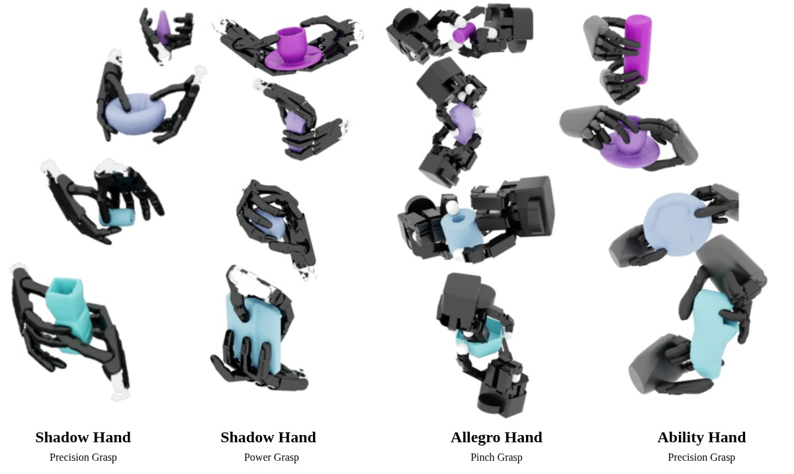

# GraspQP: Differentiable Optimization of Force Closure for Diverse and Robust Dexterous Grasping

<p align="center">
  <a href="https://arxiv.org/abs/2508.15002"></a>
  <a href="LICENSE"></a>
  
  
</p>

<p align="center">
  <a href="https://graspqp.github.io/">Project Page</a> •
  <a href="https://arxiv.org/abs/2508.15002">Paper (arXiv)</a>
</p>

<p align="center">
  
</p>

This is the official implementation of “GraspQP: Differentiable Optimization of Force Closure for Diverse and Robust Dexterous Grasping” (CoRL 2025).

## Abstract

GraspQP synthesizes diverse, robust dexterous grasps by optimizing a differentiable energy that encodes force closure via a quadratic program (QP). Coupling analytic hand kinematics and contact models with signed-distance fields enables gradient-based optimization over hand pose and joint angles. The method generalizes across hands and object categories, produces both precision and power grasps, and integrates with simulation for large-scale evaluation.

## Method overview

- Differentiable force-closure energy via QP (qpth) with friction-cone approximations.
- Distribution aware MALA\* optimizer.
- SDF-based contact modeling; backends: Warp (default), TorchSDF, Kaolin (select with `SDF_BACKEND`)
- Hand kinematics and Jacobians via pytorch_kinematics; analytic Jacobians for select grippers
- Isaac Lab integration for batched evaluation and visualization

---

## Installation

<details>
<summary><b>Local installation</b></summary>

Prerequisites:

- Linux, Python 3.10+
- CUDA-capable GPU with a matching PyTorch build
- CUDA toolkit (`nvcc`) — **only** for the full install (compiles the TorchSDF/Kaolin backends). The default lightweight install does not need it.
- Optional: NVIDIA Isaac Lab (for simulator-based evaluation)

```bash
# clone
git clone https://github.com/leggedrobotics/graspqp.git --recurse-submodules
cd graspqp

# Create an environment (choose one)
# (A) venv
# python -m venv .venv
# source .venv/bin/activate
# (B) conda
conda create -n graspqp python=3.11
conda activate graspqp

cd graspqp  # enter the package folder containing pyproject.toml

# Install PyTorch first, matched to your CUDA driver — it is NOT installed automatically.
# See https://pytorch.org/get-started/locally/ , e.g. for CUDA 12.8:
#   pip install torch==2.7.0 --index-url https://download.pytorch.org/whl/cu128

# (Recommended) Lightweight install — WARP backend, NO CUDA/nvcc compilation.
# Pulls only prebuilt wheels + pytorch_kinematics (pure Python) from git.
pip install -e '.[lite]' --no-build-isolation

# --- OR ---

# Full install — additionally builds the TorchSDF backend + pytorch3d from source.
# Requires the CUDA toolkit (nvcc). Kaolin, if wanted, is installed separately (see Docker).
pip install -e '.[full]' --no-build-isolation

# Optional: install Isaac Lab integration
cd ../graspqp_isaaclab/src
pip install -e .
```

Notes:

- **Default SDF backend is WARP** (no compilation). Switch via `export SDF_BACKEND=WARP|TORCHSDF|KAOLIN`; `TORCHSDF`/`KAOLIN` require the full install.
- The lightweight `[lite]` install needs no CUDA toolkit — WARP ships wheels and `pytorch_kinematics` is pure Python. Only `[full]` (TorchSDF/pytorch3d) invokes `nvcc`.
- Ensure your CUDA drivers match the installed PyTorch.
- Use an **editable** install (`pip install -e`): the bundled robot assets (URDFs, meshes,
  cached states) live under `graspqp/assets/` and are resolved by path at runtime, so a
  non-editable wheel install will not find them.
- For Plotly interactive visuals: `export PLOTLY_RENDERER=browser`.
- Optionally pin the GPU: `export CUDA_VISIBLE_DEVICES=0`.

</details>

<details>
<summary><b>Docker installation</b></summary>

We provide three Dockerfiles (build with the repo root as context):

- **`docker/Dockerfile`** (default, lightweight): WARP backend only. Builds on a CUDA **runtime**
  base — **no `nvcc`, no source compilation** — installing only WARP + `pytorch_kinematics`.
- **`docker/Dockerfile.torchsdf`** (full): all backends (WARP + TorchSDF + Kaolin). Builds on a
  CUDA **devel** base because TorchSDF/pytorch3d are compiled from source with `nvcc`.
- **`docker/Dockerfile.isaaclab`** (simulator): the `graspqp_isaaclab` image — the full stack
  (CUDA toolkit + kaolin + pytorch3d + TorchSDF + graspqp + `graspqp_isaaclab`) on top of an
  `isaac-lab-base` image. This is the base the Isaac Lab tooling (`scripts/isaaclab/*`) and
  downstream projects (e.g. DexEvolve) build on. Build it with the helper (below); it needs an
  `isaac-lab-base` image from **Isaac Lab 2.3 / Isaac Sim 5.1** (torch 2.7 + cu128) — defaults
  target that; override the CUDA/kaolin build args for an Isaac Sim 4.5 base.

```bash
# clone (repo root is the build context)
git clone https://github.com/leggedrobotics/graspqp.git --recurse-submodules
cd graspqp

# (Recommended) lightweight WARP image
docker build -f docker/Dockerfile -t graspqp:warp .
docker run --rm --gpus all -it graspqp:warp

# Full image with all SDF backends (needs a CUDA toolkit at build time)
docker build -f docker/Dockerfile.torchsdf -t graspqp:full .
docker run --rm --gpus all -e SDF_BACKEND=TORCHSDF -it graspqp:full   # or WARP / KAOLIN

# Isaac Lab image (graspqp_isaaclab) — requires an `isaac-lab-base` image to already exist
# (build it from an Isaac Lab 2.3 / Isaac Sim 5.1 checkout, e.g. `./docker/container.py start base`)
./docker/build_isaaclab_docker.sh          # -> image `graspqp_isaaclab`
docker run --rm --gpus all -e ACCEPT_EULA=Y --entrypoint bash -it graspqp_isaaclab
```

Both default to `SDF_BACKEND=WARP`. The base image tag (torch/CUDA) is overridable via
`--build-arg PYTORCH_IMAGE=...`; if you change it for the full image, update the matching Kaolin
wheel index URL inside `docker/Dockerfile.torchsdf`. Mount datasets with `-v /host/data:/data`.

</details>

## Quickstart demos

Run these from the **repository root** (`cd` back out of the `graspqp/` package folder used
during installation).

- Visualize a hand model (Plotly). Add `--device cpu` on machines without a GPU:

```bash
python scripts/vis/visualize_hand_model.py --hand_name allegro
```

- Generate grasps (offline):

```bash
# Example: generate grasps for a dataset
python scripts/fit.py \
  --dataset full \
  --data_root_path /path/to/datasets \
  --hand_name allegro \
  --energy_type graspqp \
  --n_contact 12 \
  --batch_size 32 \
  --n_iter 7000 \
  --log_to_wandb
```

Tip: pass specific objects via `--object_code_list code1 code2 ...` or `--object_code_file list.txt`. The `--batch_size` controls how many grasps are generated per asset.

- Visualize prediction files with Plotly:

```bash
python scripts/vis/visualize_result.py --num_assets <num_assets> --dataset <path/to/dataset/full> --show
```

## Evaluation in simulator (Isaac Lab)

Evaluate precomputed grasps:

```bash
python scripts/isaaclab/eval_object_grasp.py \
  --n_grasps_per_env 32 \
  --hand_type allegro \
  --object_type Object \
  --num_assets 8 \
  --headless
```

Show grasps in Isaac Sim:

```bash
python scripts/isaaclab/show_object_grasp.py --static_show
```

## Supported hands

- Allegro, Shadow Hand, Panda gripper, Robotiq 2F, Robotiq 3F, Ability Hand, Schunk 2F
- See `graspqp/assets/` for URDFs, meshes, and contact configs
- Adding a new hand (GraspQP): [docs/adding_hand.md](docs/adding_hand.md)
- Adding a new hand (Isaac Lab): [docs/adding_hand_isaaclab.md](docs/adding_hand_isaaclab.md)

## Troubleshooting

- TorchSDF build/import errors: ensure PyTorch/CUDA compatibility; reinstall `thirdparty/TorchSDF`
- Plotly blank window: set `PLOTLY_RENDERER=browser`

## BibTeX

If you find this work useful, please cite:

```bibtex
@inproceedings{graspqp2025,
  title     = {GraspQP: Differentiable Optimization of Force Closure for Diverse and Robust Dexterous Grasping},
  author    = {Zurbr{\"u}gg, Ren{\'e} and Cramariuc, Andrei and Hutter, Marco},
  booktitle = {Conference on Robot Learning (CoRL)},
  year      = {2025},
  url       = {https://graspqp.github.io/}
}
```

## Acknowledgements

We thank the community for open-source components that enabled this work (e.g., DexGraspNet, pytorch_kinematics, TorchSDF).

## License

© 2025 ETH Zurich, René Zurbrügg.

This project is licensed under the terms of the [MIT License](./LICENSE). See
[AUTHORS](./AUTHORS) for the list of creators and [NOTICE](./NOTICE) for
third-party components and their licenses.

Some files (the `graspqp_isaaclab` package and several scripts) are derived from
[NVIDIA Isaac Lab](https://github.com/isaac-sim/IsaacLab) and remain under the
BSD-3-Clause license; portions of the grasp-optimization code are derived from
[DexGraspNet](https://github.com/PKU-EPIC/DexGraspNet) (MIT). Bundled robot hand
and gripper models are the property of their respective manufacturers and are
**not** covered by this repository's license — see [NOTICE](./NOTICE).

## Contact

For questions or issues, please open a GitHub issue. Maintainers: René Zurbrügg (ETH Zürich).

---

Additional docs:

- Adding a new hand: [docs/adding_hand.md](docs/adding_hand.md)
- Project page: [https://graspqp.github.io/](https://graspqp.github.io/)
- Paper (arXiv): [https://arxiv.org/abs/2508.15002](https://arxiv.org/abs/2508.15002)
