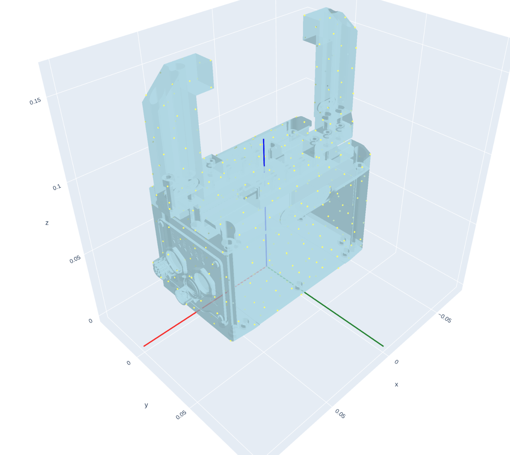

# Adding a new hand model to graspqp

This guide explains how to add a new robotic hand (or gripper) to graspqp. It covers asset preparation, Python integration, registration, and validation using the provided visualization and fitting tools.

---

## Table of contents

- Overview
- Prerequisites
- Asset Layout and Conventions
- Step-by-step: Add a new hand
  1. Prepare assets (URDF + meshes)
  2. Place files in the repository
  3. Implement the hand model in Python
  4. Register the hand
  5. Set base origin and axes
  6. Validate collision meshes
  7. Provide contact and penetration configs
  8. Add custom FK/Jacobian (optional)
  9. Visualize and validate (jacobian/randomization)
  10. Custom grasp types (optional)
  11. Fit/generate contact points on a dataset (optional)
- Troubleshooting
- References and Media

---

## Overview

Hands in graspqp are defined by a URDF + meshes and a small Python shim that tells the core how to load the model, which joints to actuate, and optionally how to compute forward kinematics (FK) and jacobians for coupled/mimic joints.

## Prerequisites

- URDF describing your hand/gripper, with visual and collision geometry.
- Visual meshes and simplified collision meshes.
- Python 3 environment aligned with this repo’s requirements.
- (Optional) ROS/xacro if your URDF is generated from xacro.

## Asset Layout and Conventions

Place your hand assets under: `graspqp/assets/<hand_folder>`

Recommended layout (example for Schunk EGU-50):

```
graspqp/assets/schunk_2f/
├─ schunk.urdf
├─ meshes/                       # visual meshes referenced by <visual> tags
│  ├─ base_link.dae
│  ├─ ...
│  └─ contacts/                  # optional meshes for per-link contact sampling
├─ collisions/                   # collision meshes referenced by <collision> tags
│  ├─ base_link.dae
│  └─ ...
├─ contact_points.json           # per-link contact sampling config (see below)
└─ penetration_points.json       # per-link penetration sampling config (see below)
```

Notes:

- In URDF, set all `<collision>` geometry mesh filenames to use the `collisions/` folder (e.g., `collisions/gripper_finger_up.stl`).
- Keep visual meshes in `meshes/`. Collision meshes are often simplified for robust physics.

## Step-by-step: Add a new hand

### 1. Prepare assets (URDF + meshes)

If you already have a URDF and meshes, skip to step 2.

Example (Schunk EGU-50 via xacro/ROS):

```bash
export GRASP_PATH=~/git/graspqp  # adjust to your path
wget https://github.com/SCHUNK-SE-Co-KG/schunk_description/archive/refs/heads/ros1.zip
unzip ros1.zip
# Build the package and source it (requires catkin + ROS)
catkin build egu_description
source ../devel/setup.bash
roscd egu_description/
# Generate URDF from xacro
mkdir -p schunk_urdf
xacro urdf/egu_50.urdf.xacro > schunk_urdf/schunk.urdf
# Copy visual meshes
cp -r meshes schunk_urdf/
# Remove package:// prefixes in URDF (path adjust)
sed -i 's|package://egu_description/||g' schunk_urdf/schunk.urdf
```

### 2. Place files in the repository

```bash
cp -r schunk_urdf "${GRASP_PATH}"/graspqp/assets/schunk_2f/
# Create empty config files to start with; fill them later.
echo "{}" > "$GRASP_PATH"/graspqp/assets/schunk_2f/contact_points.json
echo "{}" > "$GRASP_PATH"/graspqp/assets/schunk_2f/penetration_points.json
```

### 3. Implement the hand model in Python

Create a new file: `graspqp/src/graspqp/hands/schunk.py` (use your hand’s name).

Minimal example:

```python
import torch
from graspqp.core import HandModel


def getHandModel(device: str, asset_dir: str, **kwargs) -> HandModel:
    params = dict(
        mjcf_path=f"{asset_dir}/schunk_2f/schunk.urdf",
        mesh_path=f"{asset_dir}/schunk_2f/meshes",
        contact_points_path=f"{asset_dir}/schunk_2f/contact_points.json",
        penetration_points_path=f"{asset_dir}/schunk_2f/penetration_points.json",
        device=device,
        n_surface_points=512,
        forward_axis="z",
        up_axis="x",
        use_collision_if_possible=True,
        only_use_collision=True,
    )
    params.update(kwargs)
    return HandModel(**params)
```

### 4. Register the hand

Add your hand to the registry in `graspqp/src/graspqp/hands/__init__.py`:

```python
from .schunk import getHandModel as getSchunkHandModel

_REGISTRY = {
    # ...existing entries...
    "schunk2": getSchunkHandModel,  # key used as --hand_name/--hand_type
}
```

Use this key (e.g., `schunk2`) with visualization and other scripts.

### 5. Set base origin and axes

Run the following to visualize the hand:

```bash
python scripts/visualize_hand_model.py --hand_name schunk2
```

This should show your hand and the current origin.



Make sure the hand follows these coordinate frame conventions:

- The origin should be centered between the finger contact points or slightly in front of the palm.
- The forward direction (the direction the hand “points”) should match `forward_axis` (e.g., "z").
- The upward direction (up in the default pose) should match `up_axis` (e.g., "x").
- The right direction is implied by the right-handed frame (cross of forward and up).

If needed, adjust the hand’s base pose to match these conventions. For example, add a root link and fixed joint in the URDF:

```xml
  <link name="root_link"/>
  <joint name="fixed_to_root" type="fixed">
    <origin rpy="0 0 1.57" xyz="0 0 -0.155"/>
    <parent link="root_link"/>
    <child link="egu_50_base_link"/>
    <axis xyz="0 0 0"/>
  </joint>
```

Re-run the visualization command:

```bash
python scripts/visualize_hand_model.py --hand_name schunk2
```

The hand should now be aligned correctly:


### 6. Validate collision meshes

To visualize the SDF-based occupancy near collision geometry, add the occupancy grid flag:

```bash
python scripts/visualize_hand_model.py --hand_name schunk2 --show_occupancy_grid
```

This samples points on an evenly spaced grid around the hand and visualizes points very close to or inside collision meshes. If collision meshes are incorrect, the occupancy grid may not align with the hand model, showing gaps or floating points.

For example, the default collision meshes for the Schunk EGU-50 are corrupted:

```bash
python scripts/visualize_hand_model.py --hand_name schunk2 --show_occupancy_grid
```


To fix this, see the Blender remeshing examples: [Remeshing in Blender](docs/remeshing_in_blender.md). After remeshing, the visualization should look like this:


### 7. Provide contact and penetration configs

For each link that should be used for contact sampling, extract meshes to sample contact points and place them in the `meshes/contacts/` folder.
Example:

<video width="640" height="360" controls>

  <source src="contact_meshes.mp4" type="video/mp4">
  Your browser does not support the video tag.
</video>

Then, register these meshes in `contact_points.json` with the number of contact points to sample from each mesh.

```json
{
  "egu_50_finger_down": [
    ["../../schunk_2f/meshes/contacts/gripper_finger_down.STL", 8]
  ],
  "egu_50_finger_up": [
    ["../../schunk_2f/meshes/contacts/gripper_finger_up.STL", 8]
  ]
}
```

- Keys are link names from the URDF.
- Each value is a list of [mesh_path, n_points] entries.
- Paths are typically relative to the file. Adjust as needed.

For `penetration_points.json`, use a similar structure to define collision spheres used to calculate self-collisions.

Finally, once contact points are defined, visualize them:

```bash
python scripts/visualize_hand_model.py --hand_name schunk2
```

Green dots indicate the contact points sampled on the hand links.


### 8. Add custom FK/Jacobian (optional)

If your hand has mimic or coupled joints (e.g., parallel grippers), you may need to provide a custom function to compute forward kinematics and the jacobian.
For the Schunk EGU-50, the two fingers are coupled and move symmetrically. Here is an example implementation:

```python
def calculate_joints(joint_angles: torch.Tensor, hand_model):
    """Calculate forward kinematics for Schunk parallel gripper.

    Computes the poses of gripper links given joint angles. The Schunk gripper
    has symmetric fingers controlled by a single prismatic joint - the left finger
    moves in the positive direction while the right finger moves in the negative
    direction by the same amount.

    Args:
        joint_angles: Joint angles tensor with shape (..., 1) containing the
                     prismatic joint position for the left finger
        hand_model: HandModel instance containing the kinematic chain

    Returns:
        Forward kinematics result containing poses of all gripper links
    """
    # Create symmetric joint angles: left finger positive, right finger negative
    joint_angles = torch.stack(
        [
            joint_angles[..., 0],
            -joint_angles[..., 0],
        ],
        axis=-1,
    )
    return hand_model.chain.forward_kinematics(joint_angles)
```

```python
def calculate_jacobian(joint_angles: torch.Tensor, hand_model):
    """Calculate jacobian matrix for Schunk parallel gripper.

    Computes the jacobian relating joint velocities to end-effector velocities.
    For the parallel gripper, this combines the jacobians of both fingers,
    accounting for their symmetric motion (opposite directions).

    Args:
        joint_angles: Joint angles tensor with shape (..., 1) containing the
                     prismatic joint position for the left finger
        hand_model: HandModel instance containing the kinematic chain

    Returns:
        Combined jacobian tensor with shape (..., 6, 1) relating the single
        prismatic joint to the relative motion between the fingers
    """
    # Create symmetric joint angles: left finger positive, right finger negative
    joint_angles = torch.stack(
        [
            joint_angles[..., 0],  # left finger (positive direction)
            -joint_angles[..., 0],  # right finger (negative direction)
        ],
        axis=-1,
    )
    # Calculate jacobians for both fingers
    jacobian = hand_model.chain.jacobian(joint_angles)
    return (jacobian[..., 0] - jacobian[..., 1]).unsqueeze(-1)
```

```python
def getHandModel(device: str, asset_dir: str, **kwargs) -> HandModel:
    params = dict(
        mjcf_path=f"{asset_dir}/schunk_2f/schunk.urdf",
        mesh_path=f"{asset_dir}/schunk_2f/meshes",
        contact_points_path=f"{asset_dir}/schunk_2f/contact_points.json",
        penetration_points_path=f"{asset_dir}/schunk_2f/penetration_points.json",
        device=device,
        n_surface_points=512,
        forward_axis="z",
        up_axis="x",
        use_collision_if_possible=True,
        only_use_collision=True,
        default_state=torch.tensor([0.00], device=device), # <-- open position
        joint_filter=["egu_50_prismatic_1"], # <-- only actuate the prismatic joint
        joint_calc_fnc=calculate_joints, # <-- custom forward kinematics
        jacobian_fnc=calculate_jacobian, # <-- custom jacobian
    )
    params.update(kwargs)
    return HandModel(**params)
```

### 9. Visualize and validate (jacobian/randomization)

Use the viewer to inspect the hand. `--show_jacobian` visualizes the hand jacobian; `--randomize_joints` loads a random configuration.

```bash
python scripts/visualize_hand_model.py --hand_name schunk2 --show_jacobian --randomize_joints
```

The result (for the Schunk EGU-50) should look like this:


Orange lines indicate the jacobian’s predicted motion direction for each joint.

### 10. Custom grasp types (optional)

You can define named grasp types that map to different per-link contact sampling. Example:

```json
{
  "pinch": {
    "egu_50_finger_down": { "n_points": 8 },
    "egu_50_finger_up": { "n_points": 8 }
  },
  "full": {
    "egu_50_finger_down": { "n_points": 8 },
    "egu_50_finger_up": { "n_points": 8 }
  }
}
```

Visualize a specific grasp type:

```bash
python scripts/visualize_hand_model.py --hand_name schunk2 --grasp_type pinch
```

### 11. Fit/generate contact points on a dataset (optional)

Optionally, run the fitter to generate/update contact points on a dataset:

```bash
python scripts/fit.py --data_root_path /<path_to_dataset>/full --hand_name schunk2
```

## Troubleshooting

- Collisions not working as expected? Ensure `<collision>` meshes reference `collisions/...` and that files exist. Verify validity with the occupancy grid visualization. If needed, remesh in Blender (see [Remeshing in Blender](docs/remeshing_in_blender.md)).
