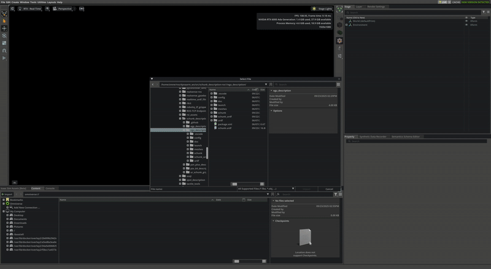
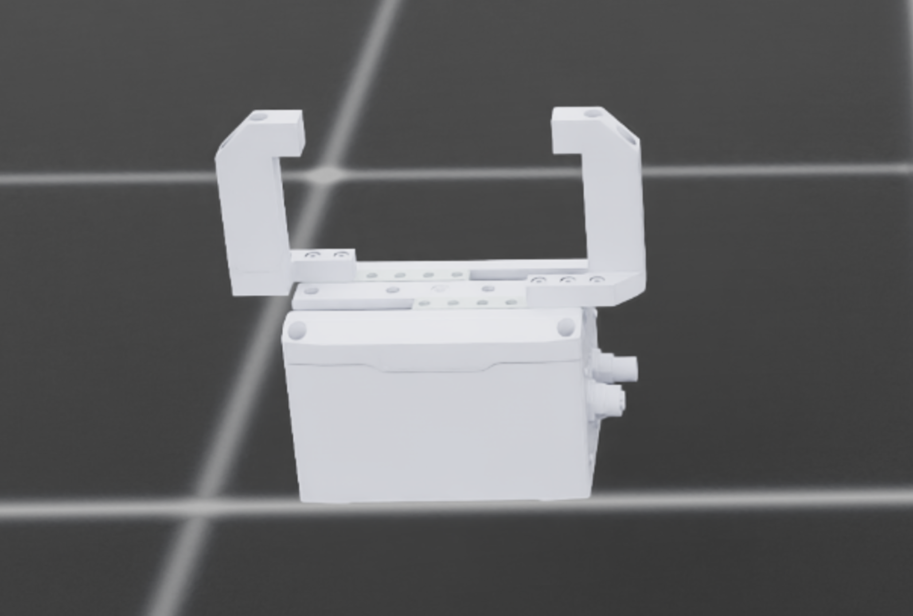

# Adding a new hand to Isaac Lab (GraspQP integration)

This guide shows how to add a new gripper/hand (example: Schunk 2F) to the GraspQP Isaac Lab integration.

## Step 1 — Convert URDF to USD

Use Isaac Sim’s URDF importer to convert your hand to USD. For Schunk 2F, convert the URDF to a single USD per articulation.

- In Isaac Sim, use the URDF importer (File → Import → URDF)
- Verify collision meshes and joint names match your expectations
- Save the resulting USD file(s)



## Step 2 — Place assets in the repository

Copy the converted USD and related files to:

```
graspqp_isaaclab/src/graspqp_isaaclab/assets/Schunk2f/
```

The folder name should match what you’ll reference in code (case-sensitive on Linux).

## Step 3 — Create a HandModelCfg for the new hand

Create `graspqp_isaaclab/src/graspqp_isaaclab/assets/schunk2f.py` by e.g. copying `robotiq2f.py` and adapting:

- Replace occurrences of `ROBOTIQ_2F` with `SCHUNK_2F`
- Update joint names (e.g., `finger_joint` → `egu_50_prismatic_1`)
- Point `usd_path` to your new USD (e.g., `assets/Schunk2f/schunk.usd`)

Example skeleton:

```python
import os

import isaaclab.sim as sim_utils
from isaaclab.actuators.actuator_cfg import ImplicitActuatorCfg
from isaaclab.assets.articulation import ArticulationCfg
from graspqp_isaaclab.models.hand_model_cfg import HandModelCfg

# Actuated joint names
SCHUNK_2F_ACTUATED_JOINT_NAMES = [
    "egu_50_prismatic_1",
]

SCHUNK_2F_CFG = HandModelCfg(
    spawn=sim_utils.UsdFileCfg(
        usd_path=os.path.join(
            os.path.dirname(__file__),
            "Schunk2f",
            "schunk.usd",
        ),
        activate_contact_sensors=False,
        rigid_props=sim_utils.RigidBodyPropertiesCfg(disable_gravity=True),
        articulation_props=sim_utils.ArticulationRootPropertiesCfg(enabled_self_collisions=True),
    ),
    init_state=ArticulationCfg.InitialStateCfg(
        pos=(0.0, 0.0, 0.5),
        rot=(1.0, 0.0, 0.0, 0.0),
        joint_pos={".*": 0.0},
    ),
    actuators={
        "fingers": ImplicitActuatorCfg(
            joint_names_expr=SCHUNK_2F_ACTUATED_JOINT_NAMES,
            effort_limit=20 * 0.125,  # 20N at finger length 0.125m
            velocity_limit=0.88,
            stiffness=100.0,
            damping=0.0,
        ),
        "implicit": ImplicitActuatorCfg(
            joint_names_expr=["egu_50_prismatic_2"],
            effort_limit=1000,
            velocity_limit=0.88,
            stiffness=0.0,
            damping=0.0,
        ),
    },
    soft_joint_pos_limit_factor=1.0,
    actuated_joints_expr=SCHUNK_2F_ACTUATED_JOINT_NAMES,
    mimic_joints={
        "egu_50_prismatic_2": {"parent": "egu_50_prismatic_1", "offset": 0.0, "multiplier": -1.0},
    },
    hand_model_name="schunk2f",
)
```

## Step 4 — Register and visualize the hand

Expose your config and add it to the visualizer’s list.

- Register the hand `scripts/isaaclab/show_hands.py`:

```python
from graspqp_isaaclab.assets.schunk2f import SCHUNK_2F_CFG

AVAILABLE_HANDS = {
    "schunk": SCHUNK_2F_CFG,
}
```

- Visualize:

```bash
python scripts/isaaclab/show_hands.py
```



## Step 5 — Clone a task config

Duplicate the Robotiq 2F task config as a starting point:

```
cp -r graspqp_isaaclab/src/graspqp_isaaclab/tasks/manipulation/grasp/config/robotiq2f \
      graspqp_isaaclab/src/graspqp_isaaclab/tasks/manipulation/grasp/config/schunk2f
```

Update the new config files to point to your `SCHUNK_2F_CFG` and adjust task parameters.
