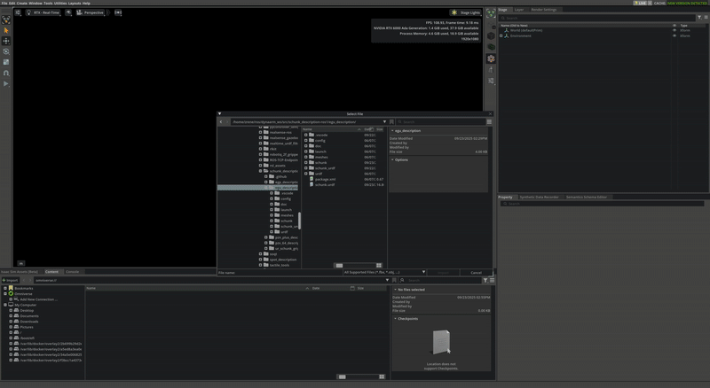
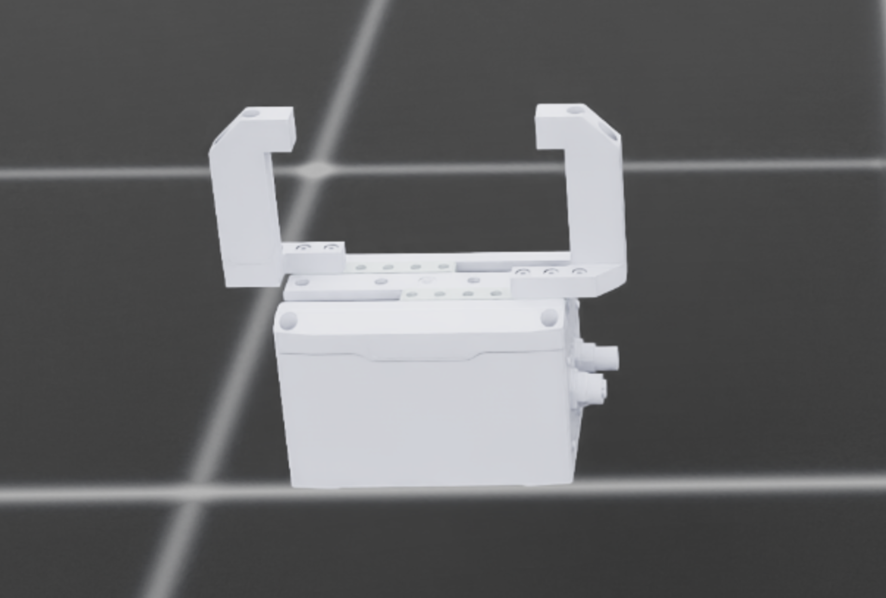

# Adding a new hand to Isaac Lab

This guide shows how to bring a hand/gripper into the GraspQP **Isaac Lab**
integration so its grasps can be evaluated in physics. The running example is the
Schunk 2F parallel gripper.

## Overview

Adding a hand to Isaac Lab is four steps: convert the URDF to USD, drop the USD
into the assets folder, describe the articulation with a `HandModelCfg`, and wire
it into the visualizer and a task config.

## Prerequisites

- The hand already works in the core `graspqp` package
  (see [Adding a new hand](adding_hand.md)) — same URDF, joint names, and axes.
- A working **Isaac Lab / Isaac Sim** installation (the `graspqp_isaaclab`
  package and its dependencies).
- The hand's URDF and meshes.

---

## Step 1 — Convert URDF to USD

Use Isaac Sim's URDF importer to convert your hand into a single USD per
articulation.

- In Isaac Sim, open the URDF importer (`File → Import → URDF`).
- Verify that collision meshes and joint names match your expectations.
- Save the resulting USD file(s).



## Step 2 — Place assets in the repository

Copy the converted USD (and any referenced files) into a new folder under the
Isaac Lab assets directory:

```bash
graspqp_isaaclab/src/graspqp_isaaclab/assets/Schunk2f/
```

> **Note.** The folder name is case-sensitive on Linux and must match the
> `usd_path` you reference in the config below.

## Step 3 — Create a `HandModelCfg`

Create `graspqp_isaaclab/src/graspqp_isaaclab/assets/schunk2f.py`, e.g. by copying
an existing config such as `robotiq2f.py` and adapting it:

- Rename the config symbol (e.g. `ROBOTIQ_2F_CFG` → `SCHUNK_2F_CFG`).
- Update the joint names to match your URDF (e.g. `egu_50_prismatic_1`).
- Point `usd_path` at your new USD (e.g. `Schunk2f/schunk.usd`).

Example skeleton:

```python
import os

import isaaclab.sim as sim_utils
from isaaclab.actuators.actuator_cfg import ImplicitActuatorCfg
from isaaclab.assets.articulation import ArticulationCfg
from graspqp_isaaclab.models.hand_model_cfg import HandModelCfg

# Actuated joint names
SCHUNK_2F_ACTUATED_JOINT_NAMES = [
    "egu_50_prismatic_1",
]

SCHUNK_2F_CFG = HandModelCfg(
    spawn=sim_utils.UsdFileCfg(
        usd_path=os.path.join(
            os.path.dirname(__file__),
            "Schunk2f",
            "schunk.usd",
        ),
        activate_contact_sensors=False,
        rigid_props=sim_utils.RigidBodyPropertiesCfg(disable_gravity=True),
        articulation_props=sim_utils.ArticulationRootPropertiesCfg(enabled_self_collisions=True),
    ),
    init_state=ArticulationCfg.InitialStateCfg(
        pos=(0.0, 0.0, 0.5),
        rot=(1.0, 0.0, 0.0, 0.0),
        joint_pos={".*": 0.0},
    ),
    actuators={
        "fingers": ImplicitActuatorCfg(
            joint_names_expr=SCHUNK_2F_ACTUATED_JOINT_NAMES,
            effort_limit=20 * 0.125,  # 20N at finger length 0.125m
            velocity_limit=0.88,
            stiffness=100.0,
            damping=0.0,
        ),
        "implicit": ImplicitActuatorCfg(
            joint_names_expr=["egu_50_prismatic_2"],
            effort_limit=1000,
            velocity_limit=0.88,
            stiffness=0.0,
            damping=0.0,
        ),
    },
    soft_joint_pos_limit_factor=1.0,
    actuated_joints_expr=SCHUNK_2F_ACTUATED_JOINT_NAMES,
    mimic_joints={
        "egu_50_prismatic_2": {"parent": "egu_50_prismatic_1", "offset": 0.0, "multiplier": -1.0},
    },
    hand_model_name="schunk2f",
)
```

> **Tip.** Use `mimic_joints` to couple dependent joints (e.g. the second finger
> of a parallel gripper), matching the coupling you defined in the core hand
> model.

## Step 4 — Register and visualize the hand

Expose your config in the visualizer by adding it to the `AVAILABLE_HANDS` dict at
the top of `scripts/isaaclab/show_hands.py`:

```python
from graspqp_isaaclab.assets.schunk2f import SCHUNK_2F_CFG

AVAILABLE_HANDS = {
    # ...existing entries...
    "schunk": SCHUNK_2F_CFG,
}
```

Then visualize all registered hands (add `--headless` to run without a GUI):

```bash
python scripts/isaaclab/show_hands.py
```



## Step 5 — Clone a task config

Duplicate an existing task config as a starting point (Robotiq 2F is the closest
match for a parallel gripper):

```bash
cp -r graspqp_isaaclab/src/graspqp_isaaclab/tasks/manipulation/grasp/config/robotiq2f \
      graspqp_isaaclab/src/graspqp_isaaclab/tasks/manipulation/grasp/config/schunk2f
```

Update the copied config files to reference `SCHUNK_2F_CFG` and adjust the task
parameters as needed. In particular, update the `gym.register(...)` `id` in the
config's `__init__.py` so the `%HANDTYPE%` slot matches the `--hand_type` you will
pass on the command line (e.g. `Isaac-Object-Grasp-Mining-schunk2-v0`).

Once registered, evaluate grasps for the new hand with the Isaac Lab scripts
(see [`scripts/README.md`](../scripts/README.md)):

```bash
python scripts/isaaclab/eval_object_grasp.py \
    --hand_type schunk2 --data_path /path/to/data --headless
```
