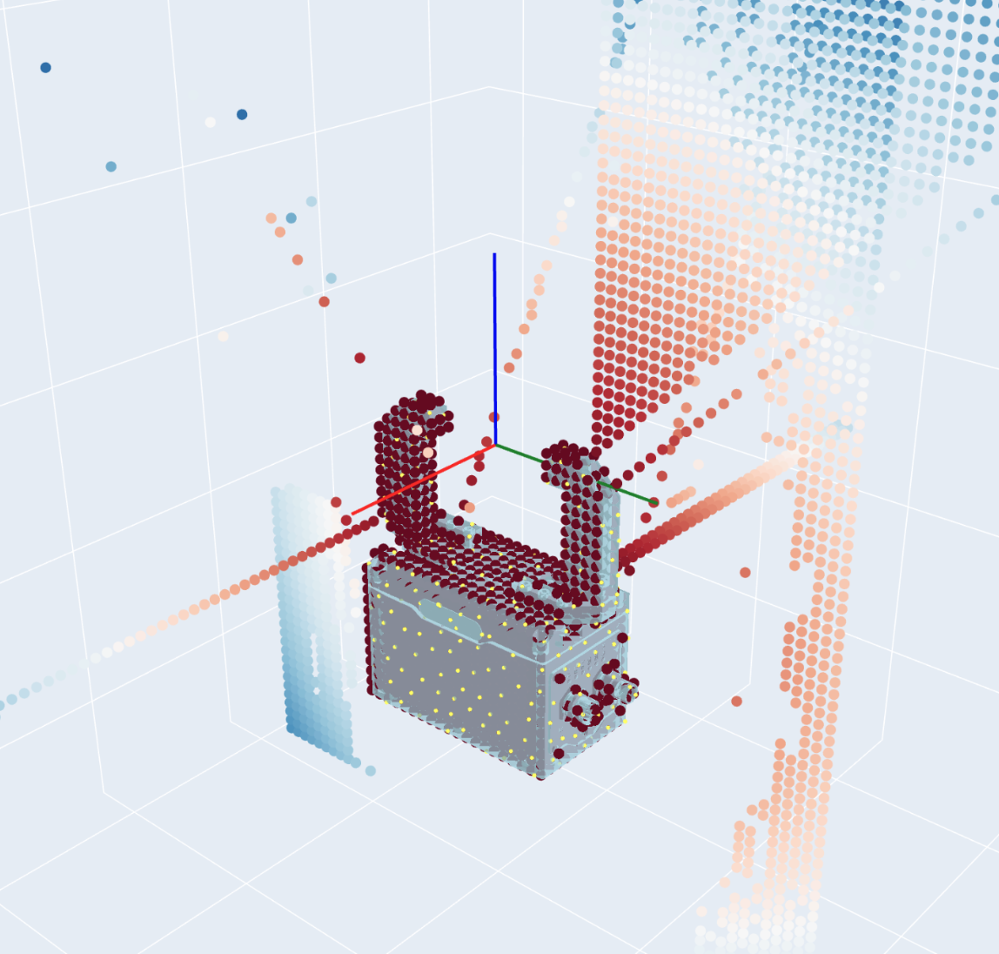
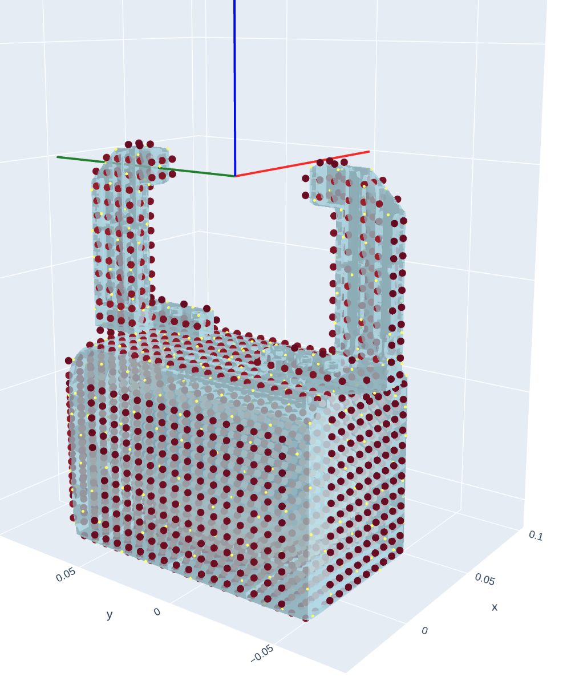
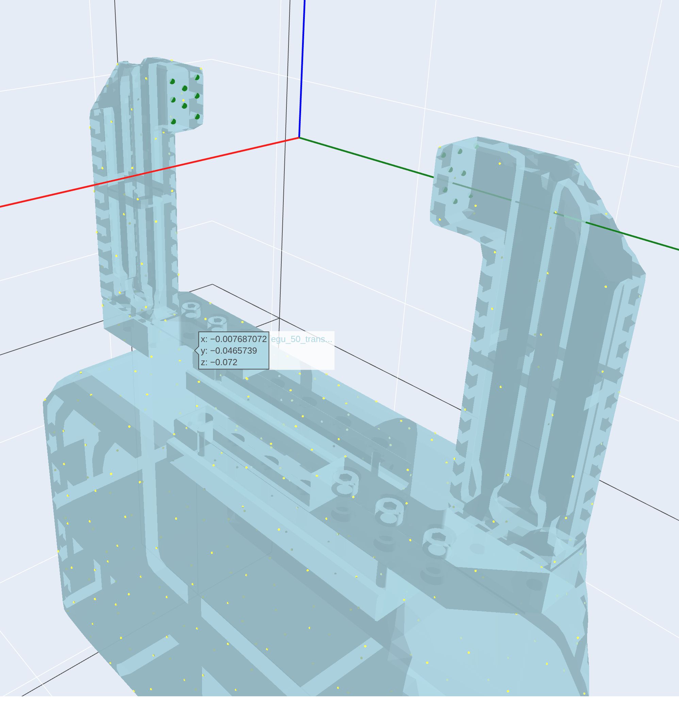

# Remeshing hand meshes in Blender

This guide covers two mesh-cleanup tasks that come up when adding a new hand to
GraspQP (see [Adding a new hand](adding_hand.md)):

1. **Fixing collision meshes** so the signed-distance field (SDF) used for
   penetration and occupancy is watertight and aligned with the hand.
2. **Extracting per-link contact meshes** used to sample contact points.

Both are done in [Blender](https://www.blender.org/) (any recent 3.x/4.x version).

## Why remeshing is needed

GraspQP builds an SDF from each link's collision geometry to detect
hand–object penetration and to compute the occupancy grid. Manufacturer-provided
collision meshes are often non-watertight, self-intersecting, or overly detailed,
which produces a corrupted SDF: the occupancy grid shows gaps or floating points
that do not follow the hand surface.

You can inspect this with the hand viewer:

```bash
python scripts/vis/visualize_hand_model.py --hand_name schunk2 --show_occupancy_grid
```



---

## Part 1 — Fixing collision meshes

The goal is a simplified, watertight collision mesh per link. In Blender, import
the mesh, apply a smoothing / remeshing pass, and re-export it into the hand's
`collisions/` folder (keeping the same filename the URDF references).

Recommended workflow:

1. **Import** the collision mesh (`File → Import`, e.g. STL/OBJ/DAE).
2. Add a **Smooth** modifier (or a **Remesh** modifier in *Voxel* mode) to close
   small holes and remove self-intersections. Keep the voxel size small enough to
   preserve the link shape.
3. Optionally add a **Decimate** modifier to keep the triangle count low.
4. **Apply** the modifiers and **export** back to the `collisions/` folder,
   overwriting the original file so the URDF `<collision>` reference stays valid.

The video below walks through the smooth-modifier approach (click to watch):

[](https://youtu.be/nz_PZ0RDFCU)

Re-run the occupancy visualization; the grid should now hug the hand surface:

```bash
python scripts/vis/visualize_hand_model.py --hand_name schunk2 --show_occupancy_grid
```



> **Tip.** Only `<collision>` meshes drive the SDF. Make sure the URDF's
> `<collision>` tags point at the files under `collisions/` (not the visual meshes
> under `meshes/`).

---

## Part 2 — Extracting contact meshes

For each link that should provide contact points, cut out the region of the visual
mesh where contact happens (e.g. the finger pad) and save it as a separate mesh
under `meshes/contacts/`. Contact points are later sampled from these meshes.

Workflow in Blender:

1. **Import** the link's visual mesh.
2. Enter **Edit Mode**, select the faces of the contact region (finger pad, tip,
   inner surface, ...), and separate them (`P → Selection`).
3. **Export** the separated region to `meshes/contacts/<link>.STL`.

Contact-mesh extraction demo (click to watch):

[](https://youtu.be/Jjc_0q2Zi3E)

Then register the meshes in the hand's `contact_points.json`, mapping each URDF
link name to a list of `[mesh_path, n_points]` entries:

```json
{
  "egu_50_finger_down": [
    ["../../schunk_2f/meshes/contacts/gripper_finger_down.STL", 8]
  ],
  "egu_50_finger_up": [
    ["../../schunk_2f/meshes/contacts/gripper_finger_up.STL", 8]
  ]
}
```

Finally, verify the sampled contact points (shown as green dots):

```bash
python scripts/vis/visualize_hand_model.py --hand_name schunk2
```


